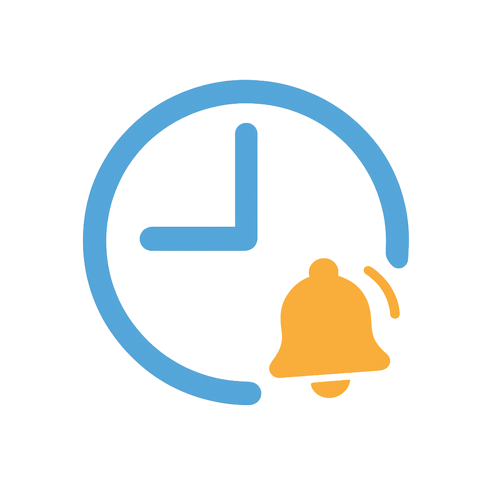

  

<h1 align="center">Workday Alerts</h1>

## Description

Workday Alerts is a SwiftUI iOS app that automatically schedules local reminders for:

- ⏰ Clock‑out for lunch
- ⏰ Clock‑in after a fixed 30 m break
- ⏰ End‑of‑day clock‑out

Each alert fires with default apple alarm sound and a 2 minute advance warning.

## Features

- One‑tap scheduling of clock‑in/out alerts
- 2 minute warnings before each event
- Haptic confirmation on schedule

## Usage

1. Select your clock‑in time and “Lunch starts in” offset.
2. Tap **Schedule / Update alerts**.
3. Alerts will repeat every minute until you open the app.

## Future Roadmap

- [ ] Title: Workday Alerts, description: alarm description on notifications
- [ ] App icon centering on app icon and launch screen
- [ ] Live Activities
